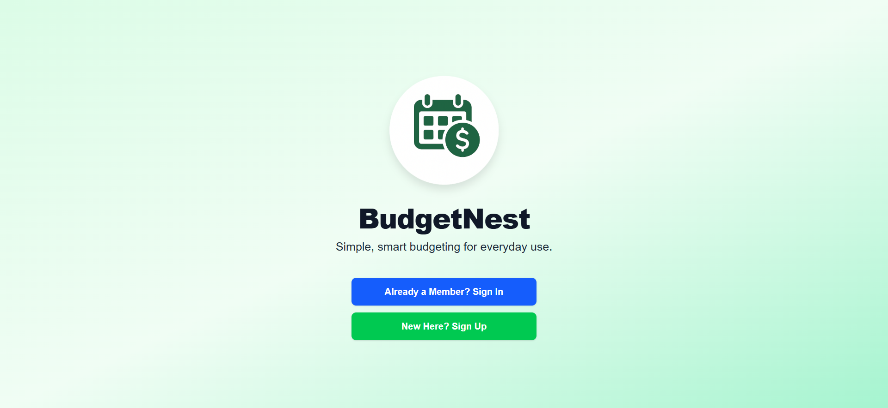
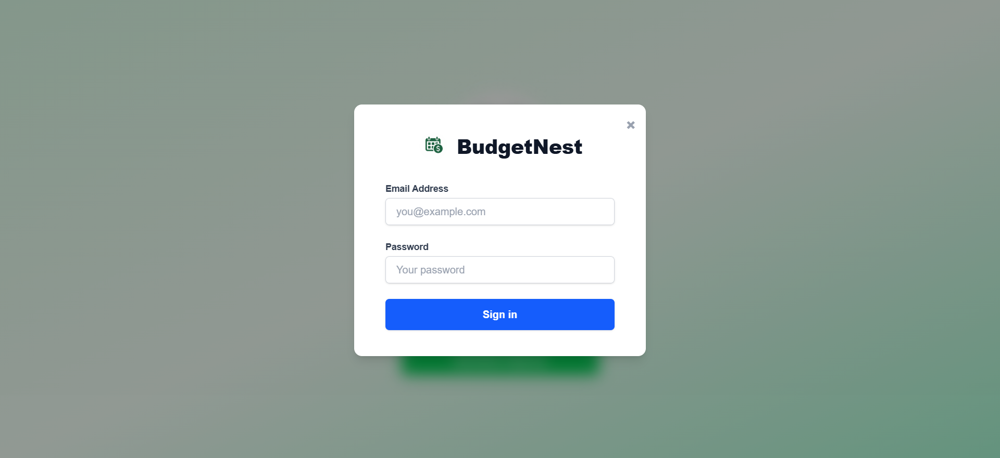
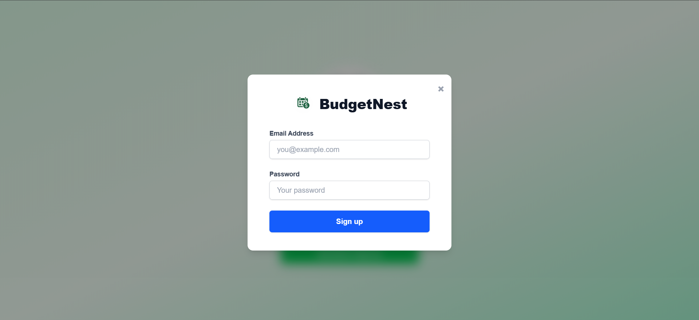
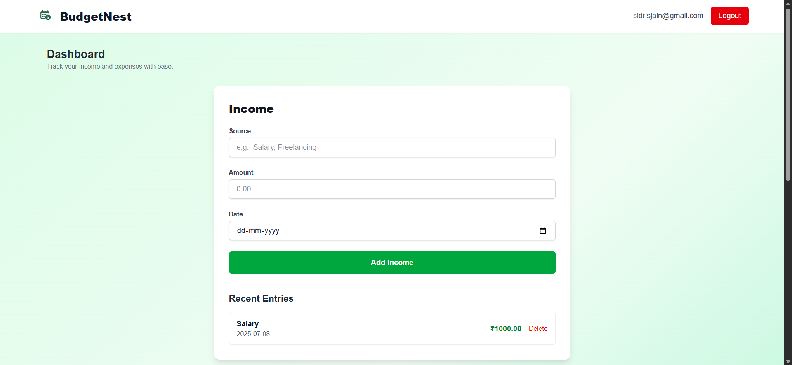

# BudgetNest

**Simple, smart budgeting for everyday use.**

BudgetNest is a minimalist web budget tracker that helps you manage income and expenses with clarity, speed, and a modern, responsive interface. Built for real users who value privacy, accessibility, and ease of use—no bloat!

## 🚀 Features

- ✨ **Mobile-first, responsive, and accessible UI**
- 🔐 **Secure authentication** (sign up, sign in, logout) with Supabase
- 🧾 **Track income and expenses** by category, description, date
- 🗂️ **Predefined categories** (Food, Transport, Rent, Utilities, Miscellaneous)
- 🗓️ **Monthly summaries, remaining balance, and quick reviews**
- 📊 **Modern design:** soft-green gradients, unified buttons and fields, clear logo branding
- 👤 **Your data stays private**, with Row Level Security by user

## 🛠 Tech Stack

- **Frontend:** [Next.js](https://nextjs.org/) (App Router)
- **Styling:** [Tailwind CSS](https://tailwindcss.com/)
- **Forms:** [react-hook-form](https://react-hook-form.com/)
- **Backend & Auth:** [Supabase](https://supabase.com/) (Postgres & Supabase Auth)
- **Deployment:** [Vercel](https://vercel.com/)
- **Database:** Supabase-hosted PostgreSQL
- **Version Control:** [GitHub](https://github.com/) + Git

## 📷 Screenshots

Add your screenshots to the `/public/screenshots/` folder or directly in `/public/`.  
Reference them in this README as below (replace with your own images):

Welcome Screen


Login Form
  

Sign-up Form


Dashboard and Income Section


Expense Section
  


## 🧑💻 Getting Started

### 1. Clone the repository

```bash
git clone https://github.com/yourusername/budgetnest.git
cd budgetnest
```

### 2. Install dependencies

```bash
npm install
```

### 3. Configure environment variables

Create a `.env.local` file in the root:

```env
NEXT_PUBLIC_SUPABASE_URL=your_supabase_project_url
NEXT_PUBLIC_SUPABASE_ANON_KEY=your_supabase_anon_key
```

Find these values in the Supabase dashboard:  
Settings → API.

### 4. Run locally

```bash
npm run dev
```

Visit [http://localhost:3000](http://localhost:3000)

## 🌍 Accessing & Using BudgetNest Online

### How to Access

Visit the live site:

[https://budget-nest-five.vercel.app](https://budget-nest-five.vercel.app/)


No installation required:  
BudgetNest is a web app and works on all modern browsers—desktop, tablet, or mobile.

### How to Use BudgetNest

**Create an Account:**

- On the welcome screen, click Sign Up.
- Enter your email and a strong password, then submit.
- (If email verification is enabled, check your inbox for a link.)

**Sign In:**

- Already registered? Click Sign In, enter your credentials, and log in.

**Dashboard Overview:**

- After logging in, you'll be taken to your personalized Dashboard.
- Your name/logo appears at the top left. Navigation bar shows your email and an easy logout button.

**Add Income:**

- Use the Income section to add new sources of income.
- Fill in the source (e.g., "Salary"), amount (choose your currency symbol), and date.
- Submit to instantly see it reflected in your summary.

**Add Expenses:**

- Use the Expenses section to log expenditures.
- Pick a category, add a description, amount, and date.
- All expenses are listed below for quick review.

**View & Manage Your Finances:**

- Your recent income and expenses are visible on the dashboard.
- Totals update automatically so you always know your current balance.
- Click Delete to remove any item if needed.

**Mobile Support:**

- BudgetNest is mobile responsive—track your finances on the go!

**Stay Secure:**

- All your financial data is private, securely associated with your account, and not accessible to others.

## ❓ FAQ

**Do I need to install an app?**  
No. Simply visit the website on any device.

**How is my data protected?**  
All data is protected with authentication and secure access control.


## 🌐 Deployment

### Deploying on Vercel

1. Connect your GitHub repo at Vercel.
2. Set the environment variables (`NEXT_PUBLIC_SUPABASE_URL`, `NEXT_PUBLIC_SUPABASE_ANON_KEY`) in the Vercel dashboard (Settings → Environment Variables).
3. Deploy!

Vercel will detect Next.js and handle everything else.


## 🧩 Project Structure

```
budgetnest/
├── src/
│   ├── app/
│   │   ├── login/
│   │   └── dashboard/
│   ├── components/
│   ├── lib/
│   └── contexts/
├── public/
│   ├── logo.png
│   └── screenshots/
│       ├── login-desktop.png
│       └── dashboard-mobile.png
├── .env.local           # ← (not committed to GitHub)
├── .gitignore
├── tailwind.config.js
└── README.md
```

## 🤝 Contributing

All contributions are welcome!

Fork the repo, create a branch, make your changes, and open a pull request.

